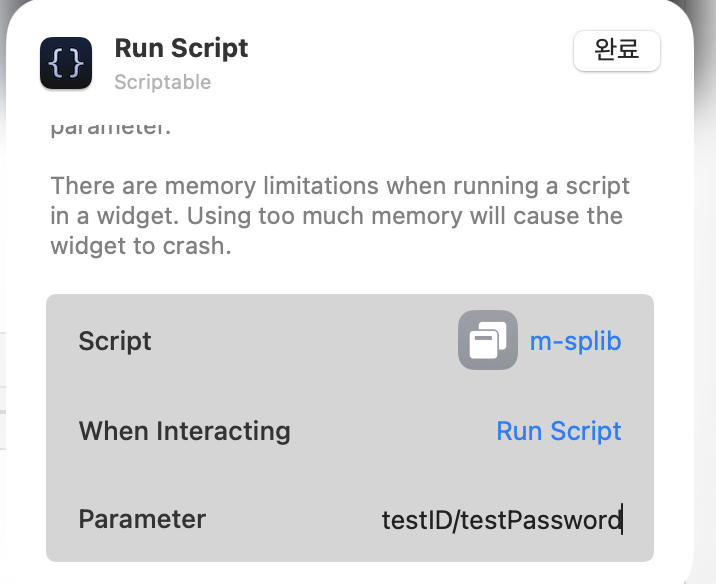

# 소개
Scriptable에서 동작하는 스크립트입니다.
Scriptable 위젯으로 등록하면, 송파구 도서관에서의 대출한 책의 권수를 표시합니다.

위젯을 여러 개 생성하면, 가족 모두의 계정을 하나의 아이폰이나 맥에서 관리할 수 있습니다.

# 사용방법
1. Scriptable app을 아이폰 또는 맥에 설치합니다.
2. Widget에 Scriptable을 small size로 추가합니다.
3. 위젯 편집 기능으로 m-splib.js를 선택합니다.
4. 그리고 Widget parameter에 송파구 도서관 홈페이지의 ID/PASSWORD를 입력합니다.
 
5. 위젯에서 도서관에서 대출한 책의 권수를 확인할 수 있습니다.
6. 위젯을 선택하면 자동으로 로그인 된 송파구 도서관 홈페이지에 접속할 수 있습니다.
7. 다른 가족의 계정을 추가로 등록하기 위해서는 2번 부터의 과정을 반복하면 됩니다.

